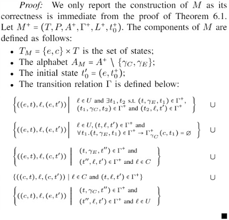
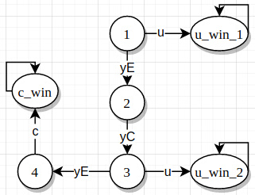
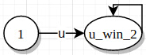
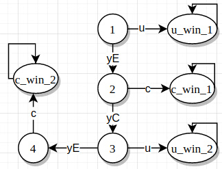
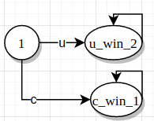
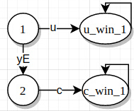
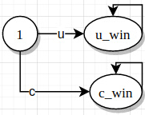

This file provides a detailed documentation for the YieldRemovalTests and the theoretical basis for the RTC controller 
construction.

### LTS transformation
Once we have a winning strategy for the BGR control problem, we need to transform the resulting LTS to
an RTC solution.

#### testYieldRemoval1

The strategy decides, for whatever reason to wait a finite amount of steps in order for the environment to go *u*.
If it doesn't, the controller can always go *c* and win.

According to the proof, the resulting automata should be (1, u, u_win_2).
It's important to notice that the transition goes to *u_win_2* instead of *u_win_1*. 
There are other transitions in the automata, but they are unreachable.

#### testYieldRemoval2

Similar to yieldRemoval1 but enabling *c* on state *2*.

In this scenario, both *u* and *c* are enabled on *1*.

#### testYieldRemoval3

There is no *yC* in state *2*, so (1, u, u_win_1) is kept.

